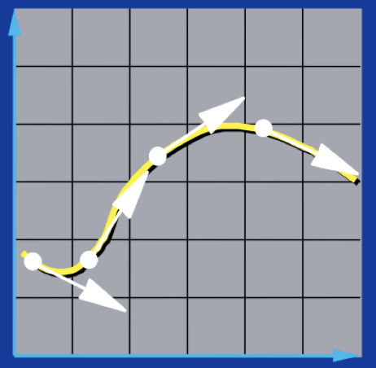
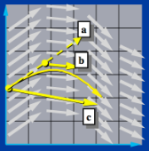

# Computergrafik 3
## Anwendung ausführen
Mit `npm install` kannst du alle Abhängigkeiten installieren. Dann kannst du die Anwendung mit `npm start` starten. Anschließend rufe `http://localhost:4200/` auf um die Anwendung zu sehen.
## Was kann dieses Programm?
Mit diesem Programm kannst du eine Textilie simulieren.
Versuche die Parameter anzupassen und beobachte, wie sich die Textilie verändert.
Der Interpolationsalgorithmus berechnet die Position eines Partikels zu einem bestimmten Zeitpunkt.
Dir stehen zwei verschiedene Interpolationsalgorithmen zur Verfügung: die Euler-Methode und die Midpoint-Methode.
Die Euler-Methode ist dabei die einfachere und schnellere Methode, die Midpoint-Methode hingegen liefert genauere
Ergebnisse.
## Funktionsweise Euler
Die Euler-Methode basiert auf einer linearen Approximation zwischen zwei aufeinanderfolgenden Zeitpunkten.
Es wird die Steigung am Ausgangspunkt berechnet und diese mit der Schrittweite multipliziert, um den Zielpunkt zu
ermitteln.
Dies ermöglicht eine einfache und schnelle Berechnung des Verlaufs, wobei jedoch beachtet werden sollte, dass die
Genauigkeit der Approximation von der Schrittweite abhängt.
Je kleiner die Schrittweite ist, desto genauer wird die Approximation.
Gleichzeitig steigt jedoch auch der Rechenaufwand.
  

  
𝑥⃗(𝑡0 + h) = 𝑥⃗0 + h &times; 𝑥⃗'(𝑡0) 
  
𝑥⃗(𝑡0 + h) = Zielpunkt
 
h = Schrittweite
 
𝑥⃗0 = Anfangswert
 
𝑥⃗'(𝑡0) = Ableitung im Anfangswert, hier Geschwindigkeit
## Funktionsweise Midpoint
Die Midpoint-Methode basiert auf der Euler-Methode.
Teilschritt a zeigt einen normalen Euler-Schritt, welcher jedoch nur zur Hälfte ausgeführt wird.
Daraufhin wird in Teilschritt b die Steigung am Zwischenpunkt berechnet.
Zuletzt wird in Teilschritt c die Steigung am Zwischenpunkt mit der Schrittweite multipliziert, um den Zielpunkt zu
ermitteln.
Die Midpoint-Methode liefert im Allgemeinen auch bei einer größeren Schrittweite genauere Ergebnisse als die
Euler-Methode.
Sie erfordert jedoch etwas mehr Rechenleistung, da für jeden Schritt zwei Mal die Euler-Methode berechnet werden
muss.
  

 
## Parameter
* Masse
* Gibt an, wie schwer die einzelnen Partikel sind. Je höher die Masse, desto größer die benötigte Kraft, um die
gleiche Beschleunigung zu erlangen.
* a = F &divide; m
  
* Größe
* Gibt die Anzahl der Partikel an. (Größe &times; Größe: ein Parameter von 10 bedeutet also 10&times;10)
  
* Strukturfeder
* Die Strukturfedern verbinden benachbarte Partikel miteinander.
Je höher die Federkonstante, desto statischer die Textilie.
* Achte darauf, dass die Textilie aufgrund von hohen Rückstellkräften instabil werden kann, wenn die Federkonstante
hoch ist.
Das kann dazu führen, dass die Partikel sehr stark beschleunigt werden.
  
* Scherungsfeder
* Die Scherungsfedern verbinden die Partikel mit ihren diagonalen Nachbarn.
Dadurch wird die Textilie in ihrer Form gehalten und hat ein konstantes Volumen.
Je höher die Federkonstante, desto statischer die Textilie.
* Achte darauf, dass die Textilie aufgrund von hohen Rückstellkräften instabil werden kann, wenn die Federkonstante
hoch ist.
Das kann dazu führen, dass die Partikel sehr stark beschleunigt werden.
  
* Biegungsfeder
* Die Biegungsfedern verbinden die Partikel mit ihren Nachbarn, die zwei Partikel weiter entfernt sind.
Dadurch wird die Textilie biegbar und knickt nicht ein.
Je höher die Federkonstante, desto statischer die Textilie.
* Achte darauf, dass die Textilie aufgrund von hohen Rückstellkräften instabil werden kann, wenn die Federkonstante
hoch ist.
Das kann dazu führen, dass die Partikel sehr stark beschleunigt werden.
  
* Schrittweite
* Gibt an, wie groß die Schrittweite in Sekunden ist, mit der die Simulation berechnet wird.
  
* Schwerkraft
* Gibt an, mit welcher Schwerkraft die Partikel bzw. die Textilie angezogen wird.
## Genutzte Frameworks / Packages
* [Angular](https://angular.io/)
* [Angular Material](https://github.com/angular/components)
* [ngx-markdown](https://www.npmjs.com/package/ngx-markdown)
* [@types/marked](https://www.npmjs.com/package/@types/marked)
* [@types/three](https://www.npmjs.com/package/@types/three)

Dieses Programm wurde im Rahmen der Projektarbeit im Modul Computergrafik 3 an der Hochschule Hannover im
Sommersemester 2023 erstellt.
